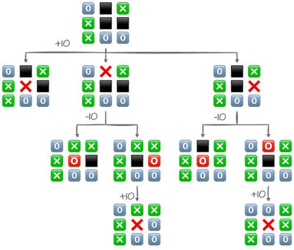

# tic-tac-toe-minimax


Implementation of Tic Tac Toe Minimax algorithm in Swift.


## MiniMax Algorithm




## Requirements

1. Xcode 16 (beta)
2. Swift 6 (comes with Xcode 16)
3. Swift-tools-version 6.0 (also comes with Xcode 16)

## Sample Usage

### Swift Package Client

Include dependency into your Swift package, for example:

```swift
// swift-tools-version: 6.0
// The swift-tools-version declares the minimum version of Swift required to build this package.

import PackageDescription

let package = Package(
    name: "TicTacToeCLI",
    platforms: [.macOS(.v10_13)],
    dependencies: [
        .package(url: "https://github.com/apple/swift-argument-parser.git", from: "1.2.0"),
        .package(url: "git@github.com:primecoder/tic-tac-toe-minimax.git", branch: "main")
    ],
    targets: [
        // Targets are the basic building blocks of a package, defining a module or a test suite.
        // Targets can depend on other targets in this package and products from dependencies.
        .executableTarget(
            name: "TicTacToeCLI",
            dependencies: [
                .product(name: "ArgumentParser", package: "swift-argument-parser"),
                .product(name: "TicTacToeMinimax", package: "tic-tac-toe-minimax")
            ]
        ),
    ]
)

```

### Swift UI App

Please see Reference [4], below.


## References

1. [Wikipedia - Game Tree](https://en.wikipedia.org/wiki/Game_tree)

2. [Wikipedia - Tic-tac-toe](https://en.wikipedia.org/wiki/Tic-tac-toe)

3. [Never Stop Building - Tic Tac Toe: Understanding the Minimax Algorithm](https://www.neverstopbuilding.com/blog/minimax)

4. [Github - VisionML - Simplified](https://github.com/primecoder/VisionML-Simplified)

5. [This project on Github](https://github.com/primecoder/tic-tac-toe-minimax)

